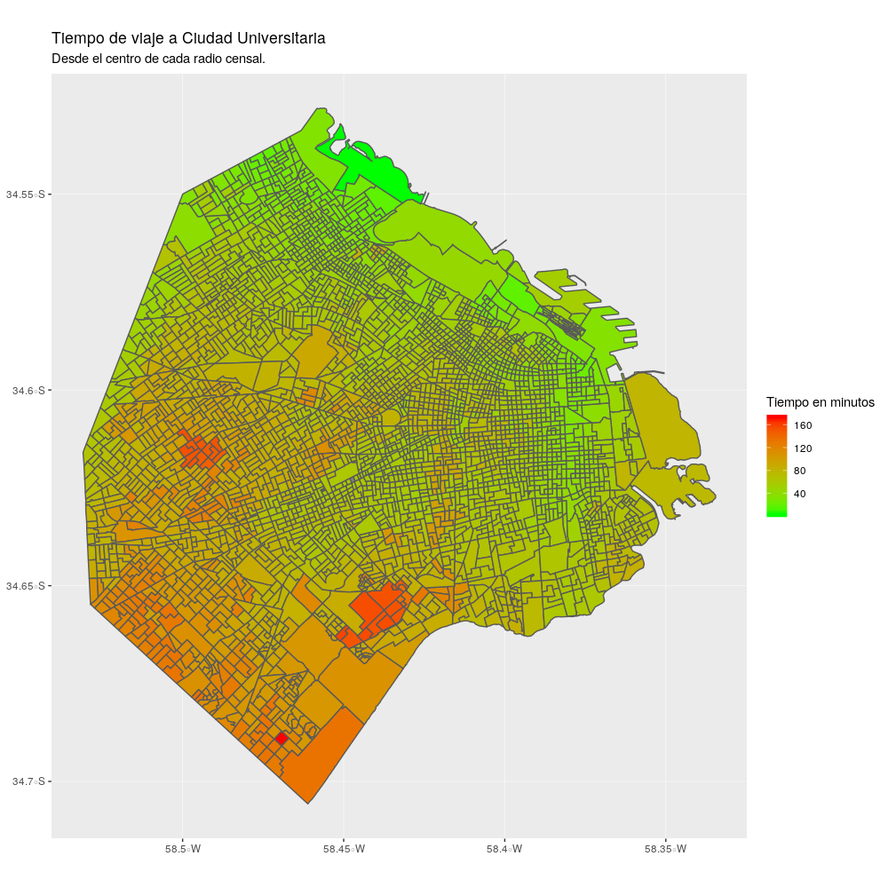

# tiempoFCEN

Usa la api de Google Maps y R para calcular y graficar tiempos de viaje a FCEN-UBA en transporte público desde el centro de cada radio censal de la CABA.

Es necesario tener una key para la api. Ponerla en apiKey_sample.R y renombrar a apiKey.R

## TODO:

- [ ] Calcular a distintas horas y promediar.
- [ ] Mejorar el ciclo que consulta la api.
- [ ] Extender al AMBA.
